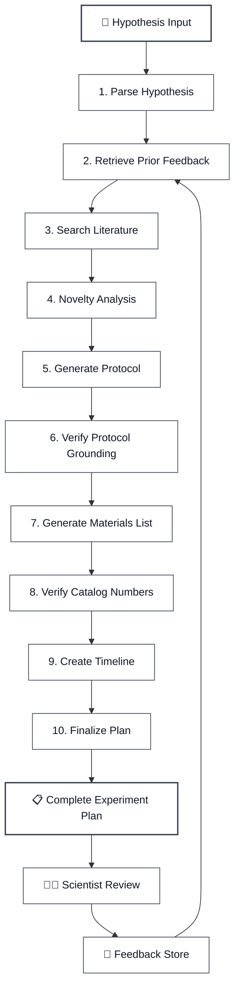
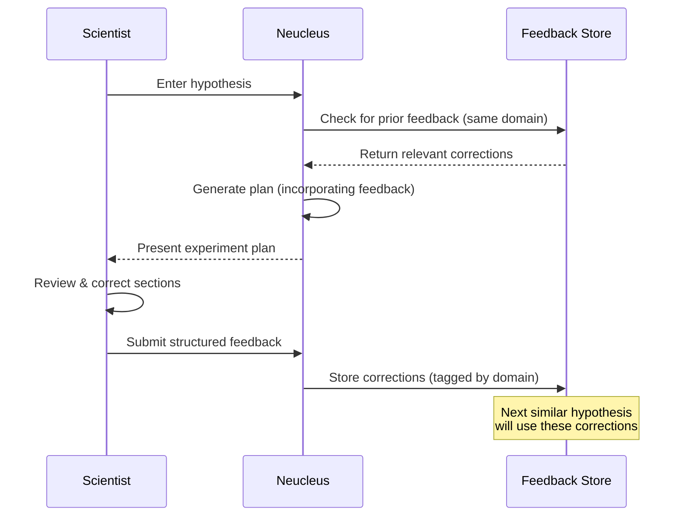
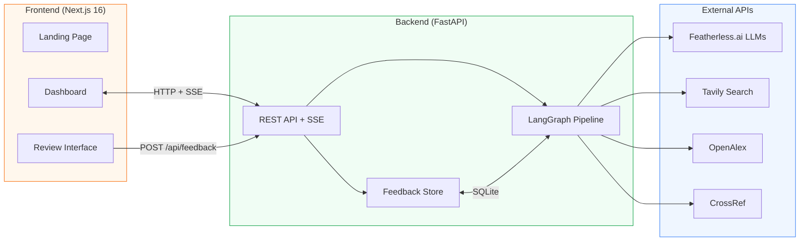

<p align="center">
  
</p>

<h1 align="center">Neucleus</h1>

<p align="center">
  <strong>From Hypothesis to Experiment — Intelligently</strong>
</p>

<p align="center">
  AI-powered experiment plan generator that transforms natural language scientific questions into complete, runnable experiment protocols with verified materials, realistic budgets, and validated timelines.
</p>

<p align="center">
  <a href="https://www.youtube.com/watch?v=YOUR_VIDEO_ID">
    
  </a>
</p>

---

## The Problem

Designing a rigorous experiment is one of the most time-consuming steps in science. A researcher starts with a hypothesis and then must:

- Search hundreds of papers to understand the existing landscape
- Write a multi-step protocol with proper controls and safety considerations
- Source specific materials with verified catalog numbers from suppliers
- Estimate a realistic budget that distinguishes equipment from consumables
- Build a phased timeline with milestones and dependencies
- Define validation criteria with statistical power

This process takes **days to weeks** of manual effort, and the quality depends entirely on the researcher's experience and familiarity with the domain. Junior researchers, interdisciplinary teams, and time-constrained PIs all suffer from this bottleneck.

## The Solution

**Neucleus** automates this entire workflow. Enter a hypothesis in plain English, and within minutes the system produces a comprehensive experiment plan grounded in real literature, with verified materials and realistic estimates.

What makes Neucleus different is the **Learning Loop** — every time a scientist reviews and corrects a generated plan, that feedback is stored and automatically incorporated into future plans for similar experiment types. The system learns from expert knowledge over time, not just retrieves it.

## How It Works

Neucleus uses a **10-stage AI pipeline** orchestrated by LangGraph, where each stage is a specialized agent:



### Pipeline Stages

| # | Stage | What It Does |
|---|-------|-------------|
| 1 | **Parse Hypothesis** | Extracts domain, organisms, techniques, and variables from natural language |
| 2 | **Retrieve Prior Feedback** | Queries the feedback database for corrections from similar past experiments |
| 3 | **Search Literature** | Searches Tavily, OpenAlex, and CrossRef for relevant papers and protocols |
| 4 | **Novelty Analysis** | Assesses whether the hypothesis is novel, partially novel, or well-established |
| 5 | **Generate Protocol** | Produces a step-by-step protocol with durations, critical notes, and safety warnings |
| 6 | **Verify Protocol Grounding** | Cross-references each protocol step against retrieved literature (HIGH/MEDIUM/LOW) |
| 7 | **Generate Materials** | Lists all required materials with suppliers, catalog numbers, and quantities |
| 8 | **Verify Catalog Numbers** | Validates catalog numbers against supplier websites via web search |
| 9 | **Create Timeline** | Generates a phased timeline with week ranges, tasks, and milestones |
| 10 | **Finalize Plan** | Computes grounding scores, assembles metadata, and packages the complete plan |

### The Learning Loop



The feedback loop means that:
- A correction to trehalose concentration in a cryopreservation protocol will be applied to all future cryopreservation plans
- Budget overestimates flagged once are corrected in subsequent generations
- Material catalog number errors, once corrected, stay corrected

## Architecture



## Tech Stack

| Layer | Technology | Purpose |
|-------|-----------|---------|
| **AI Orchestration** | LangGraph + LangChain | Stateful multi-agent pipeline with conditional edges |
| **LLM Inference** | Featherless.ai | OpenAI-compatible API with access to open-weight models |
| **Backend** | FastAPI + Uvicorn | REST API, Server-Sent Events for real-time progress |
| **Frontend** | Next.js 16 + React 19 | App Router, dashboard UI with panel-based navigation |
| **Styling** | Tailwind CSS v4 | Utility-first CSS with custom Graphite Coral theme |
| **Animations** | Framer Motion | Page transitions, micro-interactions, pipeline animations |
| **Database** | SQLite (aiosqlite) | Lightweight feedback storage, tagged by experiment domain |
| **Literature Search** | Tavily, OpenAlex, CrossRef | Web search + academic paper retrieval |
| **Validation** | Pydantic v2 | Structured output validation for all LLM responses |
| **Data Models** | TypeScript interfaces | End-to-end type safety for API contracts |

## Features

- **Complete Experiment Plans** — Protocol, materials, budget, timeline, and validation criteria from a single hypothesis
- **Literature-Grounded** — Every protocol step is scored against published sources (HIGH/MEDIUM/LOW)
- **Verified Supply Chain** — Catalog numbers validated against supplier websites in real-time
- **Novelty Assessment** — Automatic analysis of how novel the hypothesis is relative to existing work
- **Learning Loop** — Structured scientist feedback improves future plan generations
- **Real-Time Progress** — SSE-powered pipeline visualization with 10-stage stepper and elapsed timer
- **Collapsible Dashboard** — Modern panel-based UI with sidebar navigation
- **Hallucination Mitigation** — RAG grounding, chain-of-thought prompting, mandatory citations, verification passes, and uncertainty tagging

## Setup

### Prerequisites

- **Python 3.10+** 
- **Node.js 18+** and npm
- API keys for:
  - [Featherless.ai](https://featherless.ai/) — LLM inference (Premium plan recommended)
  - [Tavily](https://tavily.com/) — Web search API

### 1. Clone the Repository

```bash
git clone https://github.com/JawadGigyani/Neucleus.git
cd Neucleus
```

### 2. Backend Setup

```bash
cd backend

# Create and activate virtual environment
python -m venv venv

# Windows
venv\Scripts\activate
# macOS/Linux
source venv/bin/activate

# Install dependencies
pip install -r requirements.txt
```

Create a `.env` file in the `backend/` directory:

```env
FEATHERLESS_API_KEY=your_featherless_api_key_here
TAVILY_API_KEY=your_tavily_api_key_here
```

Start the backend server:

```bash
python main.py
```

The API will be available at `http://localhost:8000`.

### 3. Frontend Setup

Open a new terminal:

```bash
cd frontend

# Install dependencies
npm install

# Start development server
npm run dev
```

The application will be available at `http://localhost:3000`.

### 4. Usage

1. Open `http://localhost:3000` — you'll see the landing page
2. Click **"Launch Neucleus"** to enter the dashboard
3. Type a hypothesis (e.g., *"Does trehalose outperform sucrose as a cryoprotectant for HeLa cells?"*)
4. Click **"Generate Experiment Plan"** and watch the 10-stage pipeline execute in real-time
5. Review the generated plan across all sections (Overview, Protocol, Materials, Budget, Timeline, Validation)
6. Use the **Scientist Review** panel to rate, comment, and correct the plan
7. Generate a similar hypothesis again — the corrections will be automatically incorporated

## Project Structure

```
Neucleus/
├── backend/
│   ├── graph/
│   │   ├── nodes/          # 10 pipeline stage implementations
│   │   ├── graph.py        # LangGraph pipeline definition
│   │   └── state.py        # Shared pipeline state schema
│   ├── lib/
│   │   ├── llm.py          # LLM client configuration
│   │   ├── prompts.py      # All LLM prompt templates
│   │   ├── tavily_client.py
│   │   ├── openalex.py
│   │   ├── crossref.py
│   │   ├── json_utils.py   # LLM JSON output normalization
│   │   └── retry.py        # Exponential backoff for API calls
│   ├── schemas/            # Pydantic models for all data types
│   ├── db/
│   │   ├── database.py     # SQLite initialization
│   │   └── feedback_store.py # Feedback CRUD operations
│   ├── main.py             # FastAPI application entry point
│   └── requirements.txt
├── frontend/
│   ├── src/
│   │   ├── app/
│   │   │   ├── page.tsx        # Landing page
│   │   │   └── app/page.tsx    # Dashboard entry point
│   │   ├── components/
│   │   │   ├── AppShell.tsx    # Main app state & layout
│   │   │   ├── Sidebar.tsx     # Collapsible navigation
│   │   │   ├── TopBar.tsx      # Breadcrumb header
│   │   │   ├── panels/        # Content panels (Overview, Protocol, etc.)
│   │   │   ├── review/        # Scientist review components
│   │   │   └── ui/            # Reusable UI primitives
│   │   ├── lib/api.ts         # API client functions
│   │   └── types/plan.ts      # TypeScript type definitions
│   └── package.json
└── README.md
```

## API Endpoints

| Method | Endpoint | Description |
|--------|----------|-------------|
| `POST` | `/api/generate` | Start plan generation (returns job ID) |
| `GET` | `/api/stream/{job_id}` | SSE stream of pipeline progress events |
| `GET` | `/api/result/{job_id}` | Retrieve the completed experiment plan |
| `POST` | `/api/feedback` | Submit scientist review and corrections |

## Deployment

### Backend — DigitalOcean App Platform

1. Create a new app on [DigitalOcean App Platform](https://cloud.digitalocean.com/apps)
2. Connect your GitHub repo and set the **Source Directory** to `backend`
3. DigitalOcean will auto-detect the `Dockerfile`
4. Add these **environment variables** in the app settings:
   - `FEATHERLESS_API_KEY` — your Featherless.ai key
   - `TAVILY_API_KEY` — your Tavily key
   - `ALLOWED_ORIGINS` — your Vercel frontend URL (e.g. `https://neucleus.vercel.app`)
5. Deploy — the API will be available at `https://your-app.ondigitalocean.app`

### Frontend — Vercel

1. Import the repo on [Vercel](https://vercel.com/new)
2. Set the **Root Directory** to `frontend`
3. Add this **environment variable**:
   - `NEXT_PUBLIC_API_URL` — your DigitalOcean backend URL (e.g. `https://your-app.ondigitalocean.app`)
4. Deploy — Vercel will auto-detect Next.js and build

> **Important:** After both are deployed, update the backend's `ALLOWED_ORIGINS` with your actual Vercel URL, and update Vercel's `NEXT_PUBLIC_API_URL` with your actual DigitalOcean URL.

## License

This project is licensed under the MIT License — see the [LICENSE](LICENSE) file for details.

---

<p align="center">
  Built with ❤️ by <a href="https://github.com/JawadGigyani">Jawad Gigyani</a>
</p>
